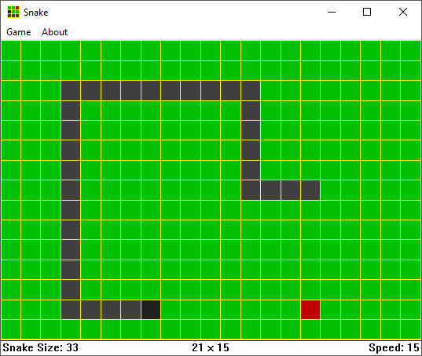

# Snake
Snake, the classic game found on old Nokia cell phones. Move the snake across the field collecting food to make the snake grow (no pun intended). Avoid hitting the walls or the own body of the snake to keep in the game. This project is a recreation in old-fashioned Windows style, using the Win32 API.

  

# Build

You can build the Snake code in a Windows environment using [MinGW](http://www.mingw.org/). You'll need at least the following packages installed:

* **mingw32-binutils**: Contains the Windows resource compiler;
* **mingw32-gcc**: Contains the C compiler;
* **mingw32-make**: Contains the make tool used to build the project.

Add the *bin* folder of MinGW (default C:\MinGW\bin) to the PATH environment variable in order to be able to use the make tool from any directory.

From the repository folder, open the Windows Command Prompt or PowerShell. In the Prompt, execute:

**mingw32-make**

to build the Snake project, **OR** execute

**mingw32-make run**

to build the project and run the compiled executable in the sequence.

The build process will create two subfolders:

* **bin**: Contains the compiled game;
* **obj**: Contains the intermediate objects that are only needed for compilation, and can be deleted safely.
